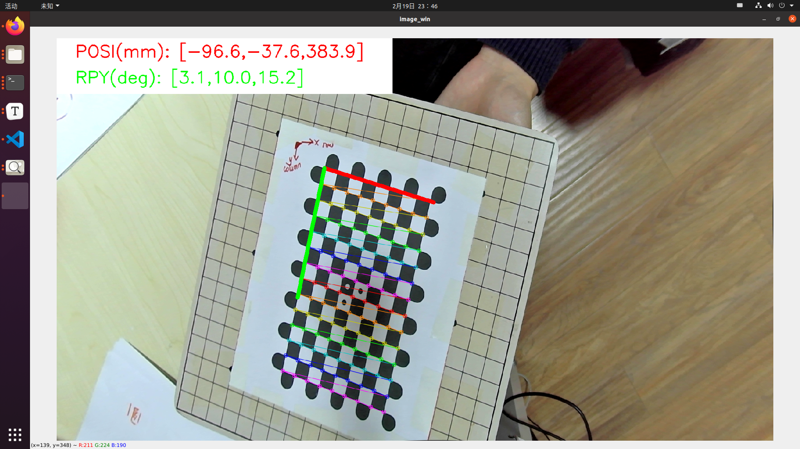

# 相机标定操作流程

[toc]

作者: 阿凯爱玩机器人 | QQ:  244561792 | 微信: xingshunkai

[1Z实验室](http://1zlab.com/) | [B站](https://space.bilibili.com/40344504) | [知乎](https://www.zhihu.com/people/mushroom-x)


## 标定流程

相机标定的方法，跟之前教程**OpenCV相机标定** 里面的操作过程一样。

配套代码见:  `示例代码/使用Radon标定板进行相机标定`

* 修改标定板的配置文件 `config/camera_calibration.yaml`

  ```yaml
  #############################
  ## 相机标定的参数
  #############################
  caliboard :         # 标定板
    row : 9           # 行数
    column : 14       # 列数
    ceil_size : 17.6  # 格子的尺寸,单位mm
    type: "radon"     # 标定板类型
  cali_img_source_path: 'data' # 标定图像的存储路径
  cali_info_save_path : 'config' # 相机标定信息存储路径
  ```

* 使用`save_capture_img.py` 脚本采集图像数据，存储到`data`文件夹中。

  ```
  python3 save_capture_img.py
  ```

* 执行标定脚本

  ```
  python3 camera_calibration.py
  ```

## 标定板位姿查看工具

同时针对机械臂手眼标定的场景开发了一个上位机工具，它在相机标定后可以实时显示标定板在相机坐标系下的位姿。 



使用方法: 

```python
python3 caliboard_pose.py
```


## 联系作者


